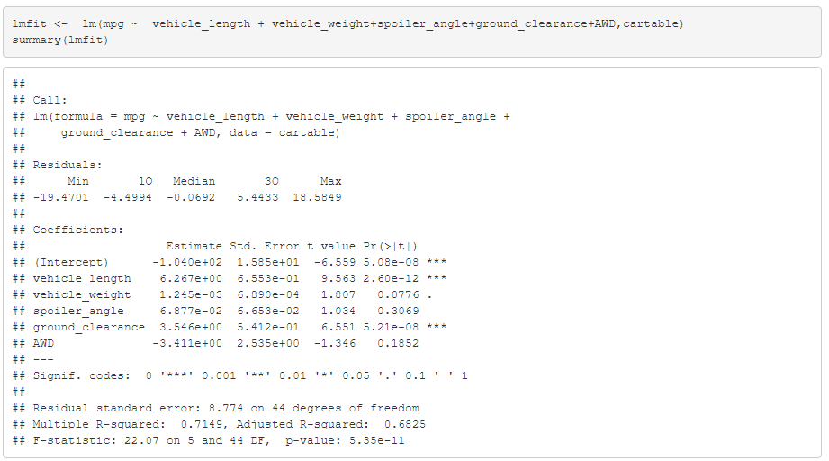
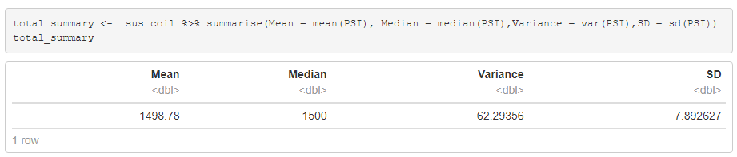
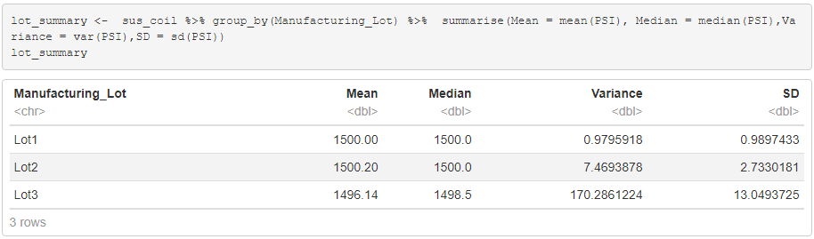
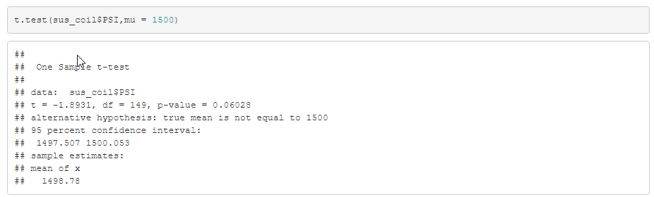
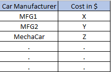

# Challenge 15: MechaCar_Statistical_Analysis

## Overview  
A few weeks after starting his new role, Jeremy is approached by upper management about a special project. AutosRUs’ newest prototype, the MechaCar, is suffering from production troubles that are blocking the manufacturing team’s progress. AutosRUs’ upper management has called on Jeremy and the data analytics team to review the production data for insights that may help the manufacturing team.

In this challenge, we help Jeremy and the data analytics team do the following:

* Perform multiple linear regression analysis to identify which variables in  the dataset predict the mpg of MechaCar prototypes
* Collect summary statistics on the pounds per square inch (PSI) of the suspension coils from the manufacturing lots
* Run t-tests to determine if the manufacturing lots are statistically different from the mean population
* Design a statistical study to compare vehicle performance of the MechaCar vehicles against vehicles from other manufacturers. For each statistical analysis, you’ll write a summary interpretation of the findings.

## Linear Regression to Predict MPG

The goal here is to do a linear regression to predict MPG. 
MPG would be the dependent variable and the other columns are passed down as independent varables. To analyze the output, one should look at **Pr(>|t|)** column. Values roughly smaller that 0.05 have impact on MPG and can reject the null hypothesis. 
As it can be seen below, *spoiler_anlge* and *AWD* dont have much impact on MPG. *Vehicle weight* is also pretty marginal and we can say in this dataset, vehicle weight doesn't have much impact on MPG. The other variables (Vehicle Lenght and ground_clearance) p values are very close to zero and have significant impact on MPG.
The **Estimate** column contains the slope for each independent variable. 
Looking at the slope of the important columns, vehicle_length and gournd clearance have slopes of 6.27 adn 3.55 respectively which is not zero.
The **R-Sqruared** value is 0.7149 which roughly means model is 71% accurate in predicting MPG.
  
**Fig1. lm Result**

## Summary Statistics on Suspension Coils

The MechaCar Suspension_Coil.csv dataset contains the results from multiple production lots. In this dataset, the weight capacities of multiple suspension coils were tested to determine if the manufacturing process is consistent across production lots.
Mean and Median are close to each other which shows data is not skewed. The standard deviation, SD, value of 7.89 can be used to calculate the variation. 3 sigma contains 99.7% of the data and shows suspension coils can vary by 3* 7.89.
  
**Fig2. Total Summary**

Lot Summary data shows the mean - median - variance - SD per Lot. Lot3 variance doesn't meet MFG spec of less than 100. The other two lots meet the MFG spec and they are way below the spec limit of 100. 
  
**Fig3. Lot Summary**

## T-Tests on Suspension Coils

Goal is to determine if all manufacturing lots and each lot individually are statistically different from the population mean of 1,500 pounds per square inch.
As it can be seenbelow, using total popoulation has a p-value of 0.06 which means we cannot reject the null hypothesis or alternatively, the Mean value is very close to 1500. 
  
**Fig4. Lot Summary**

t-test data for different lots are summarized below. Lot1 is on the top and Lot3 is at the bottom. Lot 1 to 3 have p-values of 1,0.6 and 0.04 respectively. This shows that Lot3 mean is statitically different from popoluation mean of 1500 and we can reject the null hypothesis.
  
  
  
**Fig5. Lot data**

## Study Design: MechaCar vs Competition

To study how MechaCar compares to competition we first need to define some metrics like cost, city or highway fuel efficiency, horse power, maintenance cost, or safety rating.
Then these values need to be collected which forms our data table. All the mentioned metrics can be tested. 
Null hypothesis would be MechaCar is same as competition and the alternative hypothesis could be the MechaCar is different from competition.

To test the hypothesis, we can start by doing ANOVA analysis. If this analysis shows any sign, then we can furthur follow up with more one-sample t-Test.

Lets say our data table is like below:
  
**Fig6. Sample data**
If we focus on one metric for instant cost, then the null hypothesis would be that the price of MechaCar is close to all other competiion cars(comparing to mean). The alternative hypothesis would be that MechaCar cost is different. 
we can use one sample t-test to compare MechaCar cost to competition mean. 

